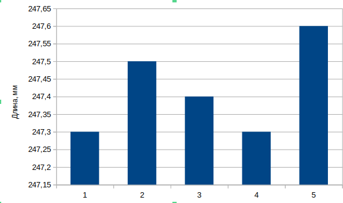
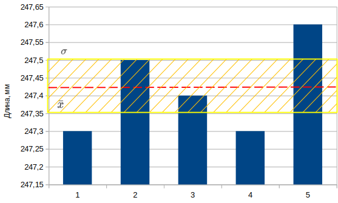
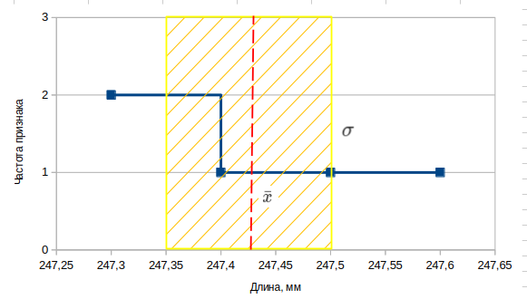
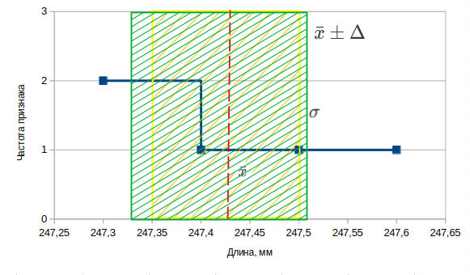

### Дополнительное задание
Дисциплина: *Вычислительная Математика*

Студент: АВТ-341, Владимиров А.В.

Преподаватель: Шелудько В.И.

### Исходные данные

*Вариант №6*

Вычисление погрешностей

При измерении длины стержня получены значения (в мм): 247.3, 247.5, 247.4, 247.3, 247.6. Найти среднеквадратическую погрешность результата измерений и доверительный интервал для истинного значения длины при доверительной вероятности 0.95 (коэфицент Стьюдента t = 2.78).

### Ход работы

Построим гистограмму распределения длины стержня при измерениях:

*Рис 1. Гистограмма распределения длины стержня*

Для расчёта среднеквадратической погрешности необходимо знать среднее выборки $\bar{ x}$ , рассчитаем его:

$\bar{ x} = \frac{\sum x_i{}}{n} = \frac{247.3 + 247.5 + 247.4 + 247.3 + 247.6}{5} = 247,42$ *мм*

Рассчитаем среднеквадратическую погрешность результата измерений $\sigma$:

$\sigma = \sqrt{\frac{\sum (x_{i} - \bar{x})^{2}}{n}} = \sqrt{\frac{(247.3-247,42)^2 + (247.5-247,42)^2 + (247.4-247,42)^2 + (247.3-247,42)^2 + (247.6-247,42)^2 }{5}} = 0,068$ *мм*

Нанесём среднее выборки $\bar{x}$ и интервал квадратичного отклонения $\sigma$ на график распределения для наглядности:

*Рис 2. Гистограмма распределения длины стержня c дополнительными построениями*

### Построение доверительного интервала

Построим график распределения частности признака от длины стержня, нанесём на него среднее выборки $\bar{x}$ и интервал квадратичного отклонения $\sigma$:

*Рис 3. График распределения длины стержня c дополнительными построениями*

Рассчитаем стандартную ошибку $m_{r}$:

$m_{r} = \frac{\sigma}{\sqrt{n}} = \frac{0,068}{2,24} = 0,03 $

Рассчитаем предельную ошибку $ \pm \Delta$:

$\pm \Delta = t * m_{r} = 2,78 * 0,03 = \pm 0,0834$ *мм*

Найдём доверительный интервал и нанесём на график:

*ДИ:* $\bar{x} \pm \Delta = 247,42 \pm 0,0834 $ *мм*

*Рис 4. График распределения длины стержня c дополнительными построениями*